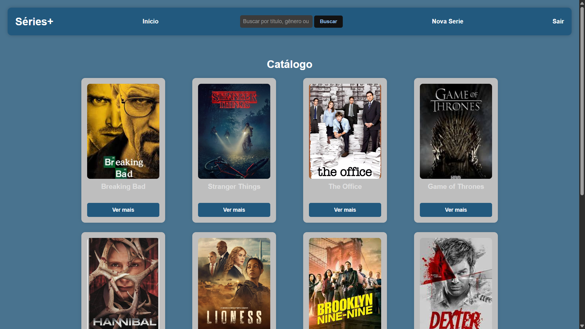
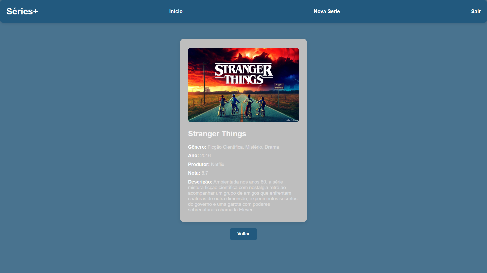

# 📺 Séries+ | Catálogo de Séries em PHP


<div align="center">
  
  &nbsp;
  
</div>

Um sistema de catálogo de séries desenvolvido em PHP que permite visualizar detalhes de produções famosas, buscar títulos por gênero ou ano e gerenciar um catálogo personalizado através de uma área administrativa protegida.

---

## 🚀 Funcionalidades

- **Catálogo Dinâmico:** Listagem de séries a partir de dados pré-definidos no sistema.
- **Busca Personalizada:** Filtro inteligente por título, gênero ou ano de lançamento.
- **Página de Detalhes:** Informações completas como produtor, nota, ano e descrição detalhada.
- **Sistema de Login:** Área restrita para usuários autenticados via arquivo JSON.
- **Cadastro de Séries:** Permite que usuários logados adicionem novas séries ao catálogo (armazenadas em sessão).

## 🛠️ Tecnologias Utilizadas

- **PHP**: Linguagem principal para lógica de backend.
- **JSON**: Utilizado para armazenamento seguro de credenciais de usuários.
- **Sessões PHP**: Para controle de autenticação e persistência temporária de novos cadastros.
- **CSS**: Estilização personalizada e layout responsivo.

## 💻 Como Rodar o Projeto Localmente

Este projeto foi desenvolvido para ser leve e não depende de bancos de dados externos (como MySQL) ou gerenciadores de pacotes (como Composer), pois utiliza a estrutura nativa do PHP.

### Pré-requisitos
- Ter o **XAMPP** (ou Laragon/Wamp) instalado no computador.

### Passo a Passo

1. **Baixar o código:**
   Abra o seu terminal (CMD, PowerShell ou Git Bash), navegue até a pasta `htdocs` do XAMPP e clone o repositório:
   ```bash
   cd C:\xampp\htdocs
   git clone https://github.com/Ana-Maria-Lange/catalogo-de-series-PHP.git (https://github.com/Ana-Maria-Lange/catalogo-de-series-PHP.git)

3. **Acessar o Projeto:**
   Abra o seu navegador e acesse o endereço:
   `http://localhost/catalogo-de-series-PHP/`

---

## 🔐 Acesso Administrativo

Para testar a funcionalidade de "Nova Série", você precisará logar no sistema:

- **Usuário:** `admin`
- **Senha:** `1234`

*(As credenciais são validadas via `usuarios.json` utilizando `password_verify` para segurança).*

> **Nota Importante:** Como este projeto utiliza **Sessões (`$_SESSION`)** para o cadastro de novas séries, os itens adicionados manualmente serão perdidos caso a sessão seja encerrada ou o navegador seja fechado.
